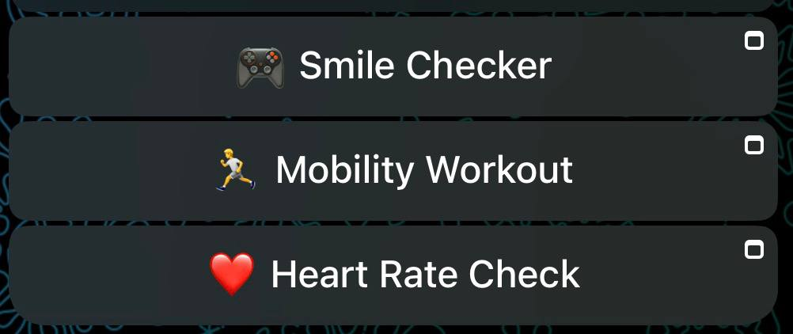

# Hi, I'm Yao Xiang 

Computer Engineering (+ AI Minor) @ NUS (Year 2) | Teaching Assistant (CS2113). Hardware design (Verilog, Arduino, C/C++) + software automation (Python, Java, JavaScript, TypeScript). Building AI tools and efficient systems.

 Website: https://yxiang-828.github.io/

### 🏆 Highlights & Hackathons

### [Synapxe × IMDA AI Innovation Challenge 2026 — Mera: The Digital Health Companion](https://github.com/Yxiang-828/Synapxe_IMDA_AI_Innovation_Challenge) (Team Lead)

 

**⚡ Try on Telegram [@Meramerarabot](https://t.me/Meramerarabot)**  
*Available every 7-9pm from now till Apr 5th 2026*

Architected a fully functional agentic Telegram health bot for aged & chronically ill patients. Deployed a Dockerized "Open Claw" multi-LLM stack using Singapore's sovereign AI models: **SEA-LION** (reasoning/vision) + **MERaLiON** (ASR/SER). 

#### 🚀 Key Features & Innovation
- **3 WASM Clinical Mini-Apps**: Smile Checker, Mobility FSM, and rPPG Heart Rate running 100% on-device for total privacy.
- **Multimodal Fusion**: Processes voice biomarkers (fatigue/sentiment) and visual symmetry in real-time.
- **Agentic FSM**: Autonomous 4-state loop from passive monitoring to clinical intervention.

<i>Clinical Edge-Games: Smile Symmetry, Mobility FSM, and rPPG Heart Rate</i>

#### 📊 Empirical Validation
- **100% Smile Precision** (Zero False Positives)
- **92–98% Mobility Accuracy** (Skeletal FSM tracking)
- **3.70 MAE rPPG** (0.93 Pearson Correlation vs Clinical Oximeter)

[View Repository](https://github.com/Yxiang-828/Synapxe_IMDA_AI_Innovation_Challenge) | [Try on Telegram @Meramerarabot](https://t.me/Meramerarabot)

### More Hackathons
- [Shoppo / TinyFish](https://github.com/Yxiang-828/TinyFish-SG-Hackathon) - Telegram-native shopping agent with cross-marketplace decision support
- [Hack4Good 2026](https://github.com/Yxiang-828/Hack4Good2026) - Care Guardian System: Modular Care Infrastructure
- [Dual-Mode AV Disruptor](https://github.com/Yxiang-828/HacX-AV-Sensor-Disruptor) - HacX 2025 Hackathon Project

---

## 💻 Personal Projects

### Wingman  AI Personal Assistant
**Team Project - NUS Orbital Apollo 2025**

**Local-first desktop app** | React + TypeScript + Electron + Python/FastAPI

Task manager, calendar, mood diary with Ollama-powered AI chat. SQLite + Supabase auth. 6 custom themes. Full privacy, packaged cross-platform distribution.

<b> Themes</b>

<table>
<tr>
<td align="center"> <b> Dark</b></td>
<td align="center"> <b> Light</b></td>
<td align="center"> <b> Yandere</b></td>
</tr>
<tr>
<td align="center"> <b> Kuudere</b></td>
<td align="center"> <b> Tsundere</b></td>
<td align="center"> <b> Dandere</b></td>
</tr>
</table>

### More Personal Projects
[View Repository](https://github.com/Yxiang-828/Wingman) 
[Helper Tools](https://github.com/Yxiang-828/Helper_Tools) - 7 CLI Tools (File Scanner, AI Upscalers, Media Processors) 
[Matrix Solver](https://github.com/Yxiang-828/MatrixSolver) - Matrix Solver (Ridge Regression, Linear Regression, Matrix Arithmetic, Gradient Descent etc. calculator)

---

## 👨‍🏫 Experiences

### Undergraduate Teaching Assistant (CS2113) @ National University of Singapore
*(Jan 2026 - Present)*
- Mentoring students in **Software Engineering & Object-Oriented Programming**.
- Guiding tutorials on Java, JUnit testing, and collaborative GitHub workflows.

## Tech Stack

##  Get in touch
-  Website: https://yxiang-828.github.io/
-  LinkedIn: https://www.linkedin.com/in/yao-xiang-733b06329
-  Email: xiangyao888@gmail.com

