  

  <a href="https://yxiang-828.github.io"><strong>Portfolio</strong></a>
  &nbsp;/&nbsp;
  <a href="https://www.linkedin.com/in/yao-xiang-733b06329"><strong>LinkedIn</strong></a>
  &nbsp;/&nbsp;
  <a href="mailto:xiangyao888@gmail.com"><strong>Email</strong></a>
  &nbsp;/&nbsp;
  <a href="https://github.com/Yxiang-828"><strong>GitHub</strong></a>

---

## About

I am a **Computer Engineering + AI Minor student at NUS**. My main direction is AI-integrated engineering: applying AI on the model side, then giving agents the tools, roles, memory, and execution surfaces they need to do useful work.

On one end, I work with applied ML, computer vision, speech, multimodal workflows, local inference, and product-facing AI systems. On the other end, I equip agents with skills, roles, tool runtimes, CLI-agent workflows, Telegram/Discord surfaces, mobile controls, and workspace integrations.

I do not want that work to float above the machine. I also keep grounding myself in robotics, C/C++, assembly, embedded systems, hardware-facing code, and latency-aware programming. The long-term arc is to merge both ends: AI systems that can reason, act, and operate close to real hardware.

<table>
  <tr>
    <td width="33%" valign="top">
      <strong>Applied AI</strong> 
      ML, CV, speech, multimodal flows 
      local inference and product workflows 
      SEA-LION, MERaLiON, MediaPipe, PyTorch
    </td>
    <td width="33%" valign="top">
      <strong>Agent Harnessing</strong> 
      skills, roles, memory, tool runtimes 
      CLI agents, Telegram, Discord, workspace integrations 
      local daemons and long-running workers
    </td>
    <td width="33%" valign="top">
      <strong>Robotics + Low Level</strong> 
      ROS 2, Jetson, Nav2, MQTT 
      C/C++, assembly, embedded systems 
      latency, control, hardware constraints
    </td>
  </tr>
</table>

Currently: **Robotics Software Intern at KABAM Robotics**, building on the Matrix-4 autonomous delivery robot stack across ROS 2, MQTT, Docker, Jetson Orin AGX, SAM3, Nav2, C++ and Python. I also teach **CS2113 Software Engineering & OOP** at NUS.

---

## Stack

**Languages**
Python · TypeScript · JavaScript · Java · C/C++ · SQL · Verilog · ARM Assembly

**AI / ML**
PyTorch · OpenCV · MediaPipe WASM · SEA-LION · MERaLiON · Whisper · Ollama · OpenRouter · local inference workflows

**Agents / Product Surfaces**
Node.js · React · React Native · Electron · FastAPI · Telegram bots · Discord bots · workspace integrations · CLI-agent orchestration

**Robotics / Systems**
ROS 2 Jazzy · Nav2 · MQTT · Jetson Orin AGX · Docker · CAN bus · SLAM · Linux · GitHub Actions · Vercel

---

## Featured Work

<table>
  <tr>
    <td width="50%" valign="top">
      <h3><a href="https://yxiang-828.github.io/projects/aiko.html">Aiko</a></h3>
      
<strong>Personal OS Agent</strong>

      
Local daemon, phone app, Telegram bridge, memory system, voice, tool runtime, and CLI-agent workers wired into one personal automation layer.

      
TypeScript · Node.js · React Native · SQLite · Ollama/OpenRouter · Tailscale

    </td>
    <td width="50%" valign="top">
      <h3><a href="https://yxiang-828.github.io/projects/kampung-kaki.html">Kampung Kaki</a></h3>
      
<strong>DSTA BrainHack CODE_EXP Open Finalist</strong>

      
Role-aware emergency coordination map for citizens, responders, and operations teams with SOS/report flows and grounded AI guidance.

      
React · MapLibre · MQTT · Redis · FastAPI · Qwen3-TTS

    </td>
  </tr>
  <tr>
    <td width="50%" valign="top">
      <h3><a href="https://yxiang-828.github.io/projects/planai.html">PLAN.AI</a></h3>
      
<strong>Deep-Research Architect Co-Pilot</strong>

      
Researches across 9 sources and compiles inline-cited 22-section technical blueprints with Mermaid C4 diagrams and implementation tasks.

      
React · Vite · TypeScript · Vercel Edge · OpenAI/OpenRouter · Mermaid C4

    </td>
    <td width="50%" valign="top">
      <h3><a href="https://github.com/Yxiang-828/Synapxe_IMDA_AI_Innovation_Challenge">Mera</a></h3>
      
<strong>Digital Health Companion</strong>

      
Telegram-native health companion with Singapore AI models, multimodal voice/vision flows, and on-device clinical mini-apps.

      
Python · FastAPI · Next.js · SEA-LION · MERaLiON · MediaPipe WASM

    </td>
  </tr>
  <tr>
    <td width="50%" valign="top">
      <h3><a href="https://github.com/Yxiang-828/TinyFish-SG-Hackathon">Shoppo</a></h3>
      
<strong>Telegram Shopping Agent</strong>

      
Turns vague text, photos, and budgets into structured marketplace searches and evidence-backed ranked shortlists.

      
Python · FastAPI · SQLite · Telegram Bot API · SSE

    </td>
    <td width="50%" valign="top">
      <h3><a href="https://github.com/Yxiang-828/Wingman">Wingman</a></h3>
      
<strong>Local AI Desktop Assistant</strong>

      
Offline-first desktop productivity app with task management, calendar, mood diary, Ollama chat, SQLite persistence, and packaged distribution.

      
React · Electron · Python · FastAPI · SQLite · Ollama

    </td>
  </tr>
</table>

---

## Hackathons & Recognition

| Year | Recognition | Project |
| --- | --- | --- |
| 2026 | DSTA BrainHack CODE_EXP Open Finalist | Kampung Kaki |
| 2026 | AI-Engineer Hackathon | PLAN.AI |
| 2026 | Synapxe x IMDA AI Innovation Challenge | Mera |
| 2026 | TinyFish SG Hackathon | Shoppo |
| 2026 | VibeWithSG | Simulation and public-service AI workflow |
| 2026 | Hack4Good | Social-impact product build |
| 2025 | HacX CS7 | AV sensor disruption / security research |

---

## GitHub Stats

  
  

  <strong>Open to internships and collaboration across applied AI, agent infrastructure, robotics, and full-stack systems.</strong>

